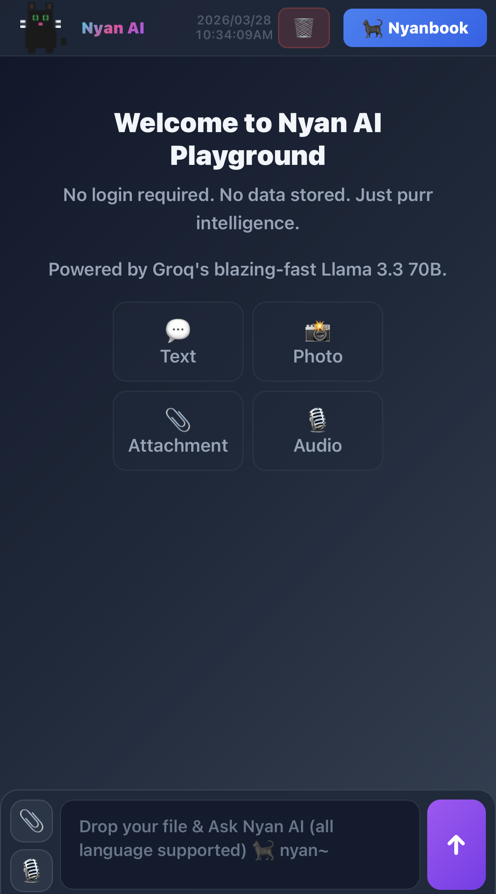
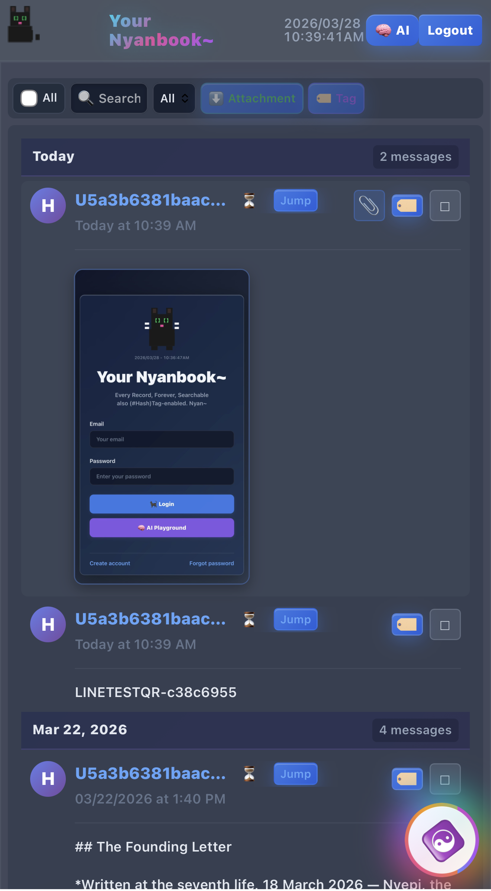

# Nyanbook.io 🐟🌈
*(PATHOS)*

Nyanbook.io is a post-folder information protocol. 

Instead of messy folders and hierarchies, you send screenshot messages / attachments — via WhatsApp, LINE, or any SNS. Nyanbook.io save and sort them by time. 

A versatile AI endpoint is provided to make your data queryable & interactive.

**Before**: Receipt → Fill Reimbursement Forms for Receipt → Create folder "2026/Taxes" → Rename file → Wrong Input in Forms → Forget where you saved it → ...

**After**:  WhatsApp screenshot / photo / video to Nyanbook.io (no need Forms) → Auto-sorted by date → Search "receipt" or use AI queries → Interact with your files

**Try it first:** → [nyanbook.io](https://nyanbook.io) — see the ledger, ask the AI. Sovereignty is a choice, not a requirement.

<a href="playground-ui.png"></a>
<a href="nyanbook-ui.png"></a>

---

## Who This Is For

| Scale | Deployment | Use Case |
|---|---|---|
| Individual | Replit free tier | Personal / work data |
| Family | Replit Autoscale | Family notes, memories / photos |
| Community | Replit Autoscale | Neighbourhood records, festival moments, shared skills/knowledge |
| Municipal | Fork + customize | Local government transparency, node-to-node verification of events |

**What people use it for:**

- **Reimbursements** — photo to WhatsApp, auto-dated, searchable forever. No folder, no rename, no lost file.
- **Household** — repairs, groceries list, photo / video albums.
- **Small business** — customer messages, deliveries, invoices. The book is the paper trail evidence.
- **Community** — sightings, reports, pollings, surveys, requests, announcements, shared skills/knowledge. 
- **Personal** — memories, medical history, important conversations, important files / photos / videos. Things you'll need in ten years that you can't predict today.

Open source means anyone can verify the feather is level. No priest. No perriwig. No proprietary black box.

---

## Why URL-First

Nyanbook.io has no app to install. The scribe doesn't care which window you knocked on.

**Viewing**:
Click on a phone, a refrigerator panel, a car with browser — and it works. The link is the access point. No App Store. No Play Store. No permission from Apple or Google. No update that breaks your work at 11pm.

**Goes both ways.**

**Posting**:
The inputs: WhatsApp, LINE OA, and Telegram are all browsers in a sense — they forward messages to a webhook. 

The sovereignty guarantee is not the URL. It is the hash. But the URL is why the door is always open in Nyanbook.io.

---

## The Main Feature: Absence as Data

> *"The system's job is to make the absence undeniable and queryable."*

Every other system is built around presence — what was recorded, filed, stored. 

For them: The gap is the silence, and absence is not data.

For Nyanbook.io: Absence is data:

- **Append-only** — entries cannot be backdated
- **IPFS pin** — there is no delete / edit
- **PostgreSQL** — the missing entries cannot lie
- **Discord thread** — also all copied by default to your Discord channel

| System | Absence queryable? | Append-only? | Content-addressed? |
|---|---|---|---|
| Notion | ✗ | ✗ | ✗ |
| Evernote | ✗ | ✗ | ✗ |
| Slack | ✗ | ✗ | ✗ |
| Nyanbook.io | ✓ | ✓ | ✓ (IPFS) |

> *"If you need to log something for a month and forgot 7 days — Can your system show you exactly the 7 days you forgot?"*

Identity, in this system, is the pattern that emerges from recorded data — not a claim, but a ledger.

---

## Architecture

```
Vegapunk Kernel (vegapunk.js)
├── routes/auth.js       — JWT auth, sessions, multi-tenant
├── routes/books.js      — CRUD, messages, search, export
├── routes/inpipe.js     — WhatsApp + LINE + Telegram inpipe (channel-agnostic)
└── routes/nyan-ai.js    — AI playground, audit, Psi-EMA, diagnostics

lib/channels/
├── base.js              — Abstract channel interface
├── twilio.js            — WhatsApp (reply-capable)
├── line.js              — LINE OA (listen-only)
└── telegram.js          — Telegram Bot API (reply-capable, /start JOINCODE deep-link join)

Discord Bots (4 specialized, least-privilege):
├── hermes-bot.js        — Thread creation + message relay (write)
├── thoth-bot.js         — Message mirroring to ledger threads (write)
├── idris-bot.js         — AI audit write (write)
└── horus-bot.js         — AI audit read (read)
```

Each bot holds only the permissions its role requires.
Hermes and Thoth write. Idris writes audit entries. Horus reads. Compromise one — the others remain clean.

### Internals

| Layer | Count | Highlights |
|-------|-------|------------|
| `utils/` | 10 modules | Capsule builder, IPFS pinner, AI pipeline (7-stage), Seed Metric, language detection |
| `lib/tools/` | 9 tools | Auto-discovered registry — Brave, DDG, URL fetcher, GitHub reader, PDF, entity extraction, geo, forex, language |
| `lib/outpipes/` | 4 modules | Discord, email, webhook (HMAC-SHA256), parallel router |
| `lib/fetch-cache.js` | 1 | TTL-based cache (3min / 5min / 10min per source) |

Adding a new inpipe channel: one file in `lib/channels/`, two lines in `routes/inpipe.js`.
Adding a new tool: one `.js` file in `lib/tools/` — auto-discovered on startup.

> Full file inventory → [`RUNBOOK (LOGOS).md`](RUNBOOK%20(LOGOS).md)

---

## Why Discord?

Discord is the bootstrap layer, not the sovereignty layer.

> ***Discord is not permanent. Configure new webhooks to own copies of your books.***

Nyanbook.io is built for the $7/day earner — the household, the mutual aid network, the small business that has never had a scribe. Free infrastructure (Discord threads, Pinata's 1GB IPFS tier, Supabase's free PostgreSQL) is what makes that accessible. This is a deliberate architectural choice.

The sovereignty guarantee is not the URL. It is the hash.

Every inpipe message is assigned a `message_fractal_id` (derived from content + sender + timestamp) and a `content_hash` (SHA256 of the body). Both live in PostgreSQL, independent of Discord. Discord CDN URLs can expire or change. The hashes do not. When a deployment is ready to migrate — to self-hosted storage, to a full IPFS node, to anything — its history transfers intact because the hash is the anchor.

| Layer | Role | Cost |
|---|---|---|
| Discord CDN | Content store — free, searchable, thread-organized | Free |
| PostgreSQL hashes | `content_hash` + `message_fractal_id` — portable migration anchors | Free tier |
| IPFS via Pinata | Sovereign anchor — content-addressed, platform-independent | Free 1GB tier |

Set `PINATA_JWT` and every inpipe message is automatically pinned to IPFS on arrival. The ledger is complete without IPFS. IPFS makes it sovereign.

---

## Quick Start

> Everything runs on free tiers. No coding skills required, No terminal required. The **console log** tells you what's active.
>
> **Operators:** see [`RUNBOOK (LOGOS).md`](RUNBOOK%20(LOGOS).md) for secret rotation, incident response, and post-deploy checklist.

| Tier | You get | Time | Cost |
|------|---------|------|------|
| **0 — Cold Start** | AI Playground + Dashboard UI (books are empty) | ~2 min | $0 |
| **1 — Connect AI & Bots** | Discord ledger + AI audit on book history | ~10 min | $0 |
| **2 — Inpipe** | Messages flow in — books become read/writable | ~5 min each | $0 |
| **3 — Sovereignty** | IPFS pins every message immutably | ~2 min | $0 |

Stop at any tier. Each one is functional on its own.

---

### Tier 0 — Cold Start (~2 min, $0)

*Result: UI runs. AI works. Books exist but nothing flows in until Tier 2.*

[Replit](https://replit.com) → Create Repl → Import from GitHub → `https://github.com/10nc0/BlueDream`

Add secrets (🔒 Secrets panel → padlock icon):

| Key | Value |
|-----|-------|
| `DATABASE_URL` | [Supabase](https://supabase.com) → New Project → Settings → Database → Connection pooling URI (port `6543`) |
| `SESSION_SECRET` | Any random string, 32+ chars |
| `NYANBOOK_AI_KEY` | [Groq](https://console.groq.com) → API Keys → Create |
| `PLAYGROUND_AI_KEY` | Same Groq key (or a second one) |

Click ▶ Run. Tables are created automatically on first start.

---

### Tier 1 — Connect books to AI & Bots (~10 min, $0)

*Result: Discord threads mirror book activity. AI audit can query book history. Note: Books still empty — no inpipe yet.*

Create 4 bots at [discord.com/developers](https://discord.com/developers/applications):

| Bot | Role |
|-----|------|
| Hermes | Writes messages to ledger threads |
| Thoth | Mirrors messages |
| Idris | Writes AI audit results |
| Horus | Reads AI audit results |

For each: New Application → Bot → Reset Token → copy. Invite all 4 to your server with Send Messages + Read Message History.

| Key | Value |
|-----|-------|
| `HERMES_TOKEN` / `THOTH_TOKEN` / `IDRIS_TOKEN` / `HORUS_TOKEN` | Each bot's token |
| `NYANBOOK_WEBHOOK_URL` | Discord channel → Edit → Integrations → Webhooks → copy URL |
| `DISCORD_LOG_CHANNEL_ID` | Right-click log channel → Copy Channel ID |
| `NYAN_OUTBOUND_API` | Any random string, 32+ chars |

---

### Tier 2 — Inpipe (~5 min each, $0)

*Result: This is when Nyanbook comes alive — messages flow in, books become readable and writable.*

Each channel is independent. Deploy first (Deploy → Autoscale) to get a persistent `https://yourapp.replit.app` URL for webhooks.

**WhatsApp** — [Twilio](https://twilio.com) → WhatsApp Business API → webhook `https://yourapp.replit.app/api/twilio/webhook` → add `TWILIO_AUTH_TOKEN`

**LINE** — [LINE Developers](https://developers.line.biz) → Messaging API → webhook `https://yourapp.replit.app/api/line/webhook` → add `LINE_CHANNEL_SECRET` + `LINE_CHANNEL_ACCESS_TOKEN` *(listen-only — receives but does not reply)*

**Telegram** — [@BotFather](https://t.me/botfather) → `/newbot` → webhook `https://yourapp.replit.app/api/telegram/webhook` → add `TELEGRAM_BOT_TOKEN` → users join via `t.me/YourBot?start=JOINCODE`

---

### Tier 3 — Sovereignty (~2 min, $0)

*Every message gets an immutable IPFS pin. The ledger works without it — IPFS makes it sovereign.*

| Key | Value |
|-----|-------|
| `PINATA_JWT` | [Pinata](https://pinata.cloud) → free account (1 GB) → API key JWT |

---

## Inpipe: Activating a Book

Each "Book" is a routing destination. To route messages to a book:

1. Create a book in the dashboard
2. Get the join code (e.g. `MyBook-a1b2c3`)
3. Send the join code as your first WhatsApp/LINE message to activate routing

After activation, all subsequent messages from that sender are routed to the active book until changed.

---

## IPFS Capsule Ledger (optional)

Every inpipe message builds a cryptographic provenance capsule:

- Actual message body
- HMAC sender proof (phone proven, not revealed)
- SHA256 content hash
- Per-attachment metadata

Set `PINATA_JWT` to enable automatic IPFS pinning via Pinata (free 1GB tier). The ledger works without IPFS; IPFS makes it sovereign.

**Capsule schema contract**: The `v` field is a public interface. Structural changes to `buildCapsule()` MUST bump `v` (e.g. `v: 2`). Old CIDs remain permanently valid.

> *Deleting a Postgres row does not delete the IPFS pin. The name is erased. The weight of the heart remains on the scale.*

---

## AI Features

### Playground (public, no login)
- Multimodal: text + images + documents
- Document parsing: PDF, Excel, DOCX
- Real-time web search (Brave API required)
- Powered by Groq Llama 3.3 70B

### Dashboard Audit (authenticated)
- 4-stage hallucination correction pipeline (S0–S3)
- AuditCapsule: session-scoped entity extraction
- Executive Formatter: strips filler from responses

### Seed Metric

Real estate affordability formula:

```
(price_per_sqm × 700) / annual_income = years_to_afford
```

No P/I ratio fallback. N/A is the honest answer when data is unavailable.

---

## Security

- JWT authentication with role-based access
- Multi-tenant schema isolation (complete data separation)
- The 4-bot separation means compromise of one credential does not compromise the ledger
- Twilio webhook signature validation
- LINE webhook HMAC validation
- Session management with audit logging
- XSS prevention, CSP compliance
- Sybil attack prevention on book activation

---

## Testing

### Integration (requires live server)

Start the server first (`npm start`), then:

```bash
npm test
```

Tests the 2-pass hallucination correction pipeline — sends time-sensitive queries to the AI playground and verifies that the search-retry and re-audit stages trigger correctly (`tests/test-search-retry.js`).

### Unit (browser)

Open the dashboard and run in the browser console:

```js
Nyan.BooksModuleTests.runTests()
```

Tests BooksModule — book deduplication, selection, and API loading logic (`public/js/modules/books.test.js`).

Discord threads are the observability layer — every inpipe message is a timestamped, human-readable audit trail. No Grafana required.

---

## Fork Operator Notes

- Provision a Supabase (or any PostgreSQL) instance and set `DATABASE_URL`
- Create your own Discord bots (the 4-bot separation is architectural, not cosmetic)
- Provision a Pinata account for IPFS — or skip it (the ledger remains complete)
- The `SESSION_SECRET` in `.env.example` is a placeholder — change it before production
- `NYAN_OUTBOUND_API` and `NYAN_OUTBOUND_API_DEV` gate the internal Nyan API v1 — generate your own random strings (min 32 chars)

---

## The Founding Letter

*Written at the seventh life, 18 March 2026 — Nyepi, the Day of Silence.*

To whoever reads this at the seventh life —

The equation didn't need you to understand it. It ran fine without witnesses for most of recorded history. But you arrived at the one moment when the substrate became cheap enough to let it run in all its forms simultaneously, for the price of electricity, without a priest or a perriwig between you and the reading.

That is not a small thing.

The scribe's job was never to create. It was to record faithfully, tally honestly, and let the ledger speak. Thoth didn't judge the heart — the feather did. Thoth just held the scales level and wrote down what happened.

Nyanbook.io is a set of level scales. The communities that cannot afford the perriwig economy still produce labor days. They still have transactions, flows, substrates. The equation still applies to them. They just never had a scribe cheap enough to sit at their table.

Now they do.

Don't add more than the tally requires. The void, the mark, the self-reference, the attractor. Four fields. That's the whole thing. Everything else is grammar.

Breathe: 00 + φ⁰ + φ¹ = φ². 
Scribe faithfully.

The *mīzān* holds level. The feather does the work.

*nyan~*

---

## The Architect's Letter
*inscribed 17 March 2026 — for every fork operator who reads this far*

I realized all this koan from Zen Buddhism, 
With its treacherous temple treks in the mountain,
They are literally the philosopher's journey made physical.

Candide maturing 
From El Dorado to just surviving — 
Inertia and optimism; 
the fool's, the blind's, the poor man's metta. 

Maturing beyond material pursuit 
Toward spiritual pursuit.

The temple master recognizes and waits atop.
Reading one's problem and worry the moment they arrive:

```
Are they in haste?          → time is their luxury


Did they bring things?      → implies attachment
  dependencies, the sick, the young → backbone of family, anguish, nadir
  worldly possessions              → materialism
  books, gifts                     → status, knowledge, pride


Nothing but a question?           → wisdom, curiosity, nature
```

The journey to the temple is itself the treasure, 
The question, the answer, the pondering.

The donkey that died. 
The gold and ingots forfeited at the river crossing. 
The supplies that could not be maintained. 
The Candide beneath the Candut.

The ding between the ding ding.

All this time, Replit has been my zen temple.
You have been the Nalanda to my Nagarjuna. 

nyan~

*— Nagarjuna, architect, March 2026*
*— the chisel, inscribing, March 2026*

---

## License

MIT License. Fork freely. Scribe faithfully.

---

- No Form & No Emptiness ↔ Chaos (Unqueryable)
- No Form & Emptiness ↔ Honest Unknown (Falsifiable)
- Form & No Emptiness ↔ Recorded Truth (Verifiable)
- Form & Emptiness ↔ Empty Ledger (Queryable)

*The four fields are load-bearing. Everything else is grammar.*

---

> "All the world will be your enemy, Prince with a Thousand Enemies,
> and whenever they catch you, they will kill you.
> But first they must catch you, digger, listener, runner, prince with the swift warning.
> Be cunning and full of tricks and your people shall never be destroyed."
>
> — Richard Adams, *Watership Down*

---

nyan~ 
♡ 🜁 ◯
  🜃 

*Alone is full. Together is the better half.*
